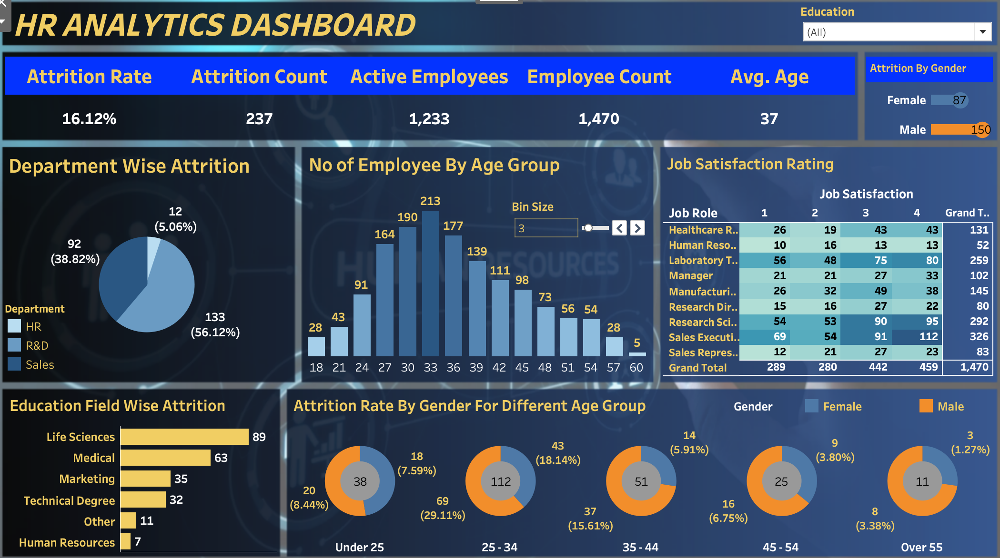

# 📊 HR Analytics Dashboard

An interactive HR Analytics Dashboard built using **Tableau** to analyze employee attrition, workforce demographics, and job satisfaction. The dashboard helps identify key trends through interactive visualizations and dynamic filtering.

## Dashboard Highlights

* Overall Attrition Rate
* Attrition Count
* Active Employees
* Employee Count
* Average Employee Age
* Department-wise Attrition
* Employee Distribution by Age Group
* Job Satisfaction Analysis
* Education-wise Attrition
* Gender-wise Attrition by Age Group
* Interactive Education Filter

## Key Insights

* Overall attrition rate is **16.12%**.
* The **R&D department** has the highest employee attrition.
* Most employees fall in the **30–35 years** age group.
* **Life Sciences** has the highest attrition among education fields.
* The average employee age is **37 years**.

## Tools Used

* Tableau Public
* Microsoft Excel

## Skills Demonstrated

* Data Visualization
* Dashboard Design
* Calculated Fields
* KPI Creation
* Interactive Filters
* Business Insights

## Files Included

* `HR Data.xlsx` – Dataset
* `HR Analytics Dashboard.twbx` – Tableau Workbook
* `dashboard.png` – Dashboard Preview
* `dashboard_demo.mp4` – Interactive Dashboard Demo

## Dashboard Preview

  

## Dashboard Demo

▶️ **Watch the interactive dashboard here:**

[dashboard.mp4](assets/dashboard.mp4)

## Author

**Akshat Raj**
